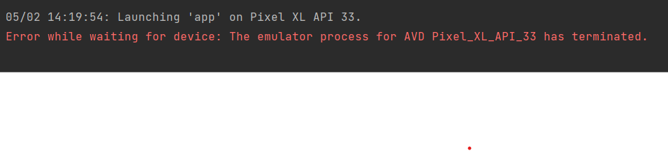

# Rapport

## Add a RecyclerView to your layout
Add a recyclerview with constraints. To collect data from json url.

## Add member variables in your activity
Add member variables to declare variables used inside local file.

## Create a RecyclerView.Adapter
Created a Recyclerview that handle data from json url.

## Create a RecyclerView.ViewHolder
Viewholder know where inside the data the list is located.

## Use getJson() to download your json data by changing the JSON_URL
Get Json collect the json data from the specific url.

## Write code in onPostExecute()
Onpost execute is a function that happens when a new post is execute. 

## Display the names of the mountains in the RecyclerView
To display names of mountains it need to be in a format of strings.

```xml
    <androidx.recyclerview.widget.RecyclerView
        android:layout_width="409dp"
        android:layout_height="729dp"
        app:layout_constraintBottom_toBottomOf="parent"
        app:layout_constraintEnd_toEndOf="parent"
        app:layout_constraintStart_toStartOf="parent"
        android:id="@+id/Recyclerview"
        app:layout_constraintTop_toTopOf="parent" />
```
_Recyclerview_


```java
public class MainActivity extends AppCompatActivity implements JsonTask.JsonTaskListener {
private ArrayList mountains;
private RecyclerViewAdapter adapter;
}
```
_Member Variables_


```java
public class RecyclerViewAdapter extends RecyclerView.Adapter<RecyclerViewAdapter.ViewHolder> {

    private List<RecyclerViewItem> mountains;
    private LayoutInflater layoutinflater;
    private OnClickListener onClicklistener;

    RecyclerViewAdapter(Context context, List<RecyclerViewItem> items, OnClickListener onClickListener) {
        this.layoutinflater = LayoutInflater.from(context);
        this.mountains = items;
        this.onClicklistener = onClickListener;
    }
}
```
_Adapter_

```
public ViewHolder onCreateViewHolder(@NonNull ViewGroup parent, int viewType) {
        return new ViewHolder(layoutinflater.inflate(R.layout.list_item, parent, false));
    }

    @Override
    public void onBindViewHolder(ViewHolder holder, int position) {
        holder.title.setText(mountains.get(position).getTitle());
    }

    @Override
    public int getItemCount() {
        return mountains.size();
    }

    public class ViewHolder extends RecyclerView.ViewHolder implements View.OnClickListener {

        TextView title;

        ViewHolder(View itemView) {
            super(itemView);
            itemView.setOnClickListener(this);
            title = itemView.findViewById(R.id.title);
        }
    }
```
_Viewholder_

```
        Gson gson = new Gson();
        Type type = new TypeToken<ArrayList<Mountain>>() {}.getType();
```
_getJson()_


```
    @Override
    public void onPostExecute(String json) {
        Gson gson = new Gson();

        Type type = new TypeToken<ArrayList<Mountain>>() {}.getType();

        ArrayList<Mountain> data = gson.fromJson(json, type);
        mountains.addAll(data);
        adapter.notifyDataSetChanged();

        RecyclerViewAdapter adapter = new RecyclerViewAdapter(this, mountains, new RecyclerViewAdapter.OnClickListener() {
            @Override
            public void onClick(RecyclerViewItem item) {
                Toast.makeText(MainActivity.this, item.getTitle(), Toast.LENGTH_SHORT).show();
            }
        });
    }
```
_onPostExecute()_

```
   public Mountain (String n, String l, int h)
    {
        name=n;
        location=l;
        height=h;
    }

    public String info()
    {
        String tmp= new String();
        tmp+=name+location+height;
        return tmp;
    }

    public void setName (String n)
    {
        name=n;
    }
    public String getName()
    {
        return name;
    }
```
_Display the names of the mountains_


Wrong message fixed with removing space on hardware.  